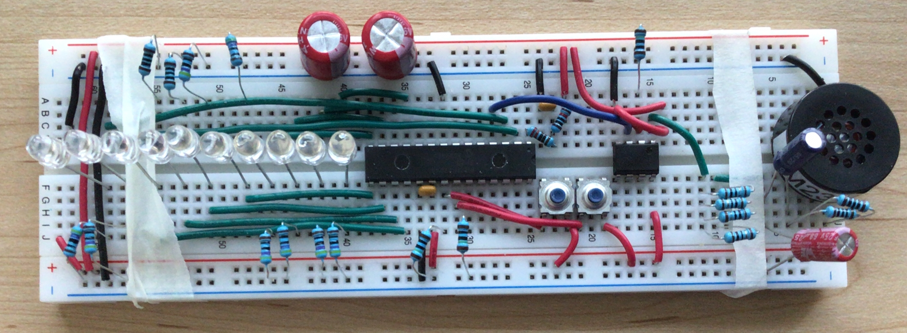

# Jovial

## Operation Instructions and Some Notes:

The operation instructions included here are for prototype three of Jovial—the most advanced prototype that we were able to build. This prototype was still very early stage and lacked many of the capabilities that a more advanced prototype would have had. Instructions detailing how a more advanced version of this device might work are not included here because, in the opinion of this designer, the idea of how a product should be operated needs to move and shift as the design advances and it is possible to see, touch, carry, and drop increasingly sophisticated prototypes.

### Prototype Three:

### Power:
This prototype requires a power source between four and five volts with five volts being a little better. Three AA batteries in series are what was typically used during testing. However, a five-volt lithium-ion battery would also work, as would a five-volt wall supply. Regardless of the source used, one needs only to hook it to the power and ground rails of the breadboard to make the circuit operational.

### Starting the PIC18:

This protype needs to be reprogrammed by the PIC Kit 4 after every start up. The source code necessary for this can be found in this repository in the file “Jovial.X”.

### The Clock:

Plans to program this protype for more advanced timer functions had be called off after the upper half of the B-register of the designers PIC18 stopped working. Therefore, we scaled back to a simple sixteen-minute counter with the ten LEDs seen to the left of the PIC18 in the above picture serving as a binary display. The six LEDs closest to the PIC18
display seconds, and the four LEDs farthest from the PIC18 display minutes. The clock can be reset at any time by pressing both buttons at the same time.

### The Inspirational Message Button:

The button seen farthest from the PIC18 in the above picture was originally meant to play inspirational messages when pressed. Unfortunately, the code necessary to connect the PIC18 to audio files was not available soon enough to implement this. As a stand in, pressing this button currently plays a—very digital—rendition of a couple bars from the song “When We Were Young”. Changing this to an inspirational message would be fairly straight forward after the process of connecting the PIC18 to audio files was complete.

### The Nutrition Information Button:

The button seen closest to the PIC18 was intended to play messages giving the user nutritional information when pressed. As with the other button, the resources to do this where not available soon enough. Currently, pressing it will play the closing bars of “When We Were Young”—again, this is a very digital rendition.

# How to Create Jovial Prototype 3:

### Building It:

Below is an image of the circuit design. This schematic is only meant to represent the circuits of the Jovial protype themselves and is not meant to suggest layout.
.jpg)

To build the prototype simply create this combination of circuits, arranged according to personal preference, on one or more breadboards. When we created our copy of this protype we chose to arrange it as can be seen in the photograph at the top of the page. This was done to make handling it as close as possible to how it would be to handle a finished version of Jovial. However, this arrangement proved be a little impractical since it left so little room on the breadboard that it was hard to experiment with the design without pulling the whole thing apart.

### Programing It: 

The PIC18, that serves as the brain of the Jovial prototype, is programed using MPLAB and a PIC Kit 4. The source code used to run this prototype can be found within this repository in the file “Jovial.X”. Specifically, most of the code related to the functionality of the protype is located in the function “UserAppRun()” which can be found by opening “Jovial.X” then opening “Source Files” and finally opening “user_app.c” and scrolling to the bottom.

#### Here is a copy of the “UserAppRun()” source code:

// I tried to get it to play the very end of "when we were young" but it didn't come out super well. I may have made a mistake in the note conversions or timing somewhere.
    static u16 au16MyTime[] = {N16, N8, N8, ND8, N16, N16, N16, N8, ND8, N16, N8, N8, //0 to 11

void UserAppRun(void)
{
    static u8 u8CSetting = 0;
    static u16 u16Hours = 0;
    static u16 u16Minutes = 0;
    static u16 u16Seconds = 0;
    static u16 u16ClockMilS = 0;
    
    
    static u8 u8SongSwitch = 0;
    
    static u16 au16Restless[] = {Bb4, Bb4, Bb4, Bb4, NN, G4, G4, G4, Ab4, Ab4, G4, G4, G4, G4,G4, F4, Eb4, Eb4, F4};
    static u16 au16RestlessTime[] = {N16, N16, N16, N8, N16, N16, N16, N16, N8, ND8, N16, N16, N8, N16, N8, N16, N16, N16, N16};
    
    
    // I tried to get it to play the very end of "when we were young" but it didn't come out super well. I may have made a mistake in the note conversions or timing somewhere.
    static u16 au16MyTime[] = {N16, N8, N8, ND8, N16, N16, N16, N8, ND8, N16, N8, N8, //0 to 11
                               ND8, N16, N16, N16, N8, N8, N16, N16, N16, N16, N16, N16, N8, N8, N4, N8, N16, N16, NT8, NT8, NT8,  // 12 -> 32
                               ND4, N16, ND8, N16, ND16, ND8, N16, N2, N2};
    
    static u16 au16MyNotes[] = {Bb4, Bb4, Bb4, Bb4, G4, G4, G4, Ab4, Ab4, G4, G4, G4, // 0 -> 11
                                G4, F4, Eb4, F4, NN, NN, Eb4, Eb4, G4, F4, Eb4, F4, F4, C4, NN, NN, Eb4, Eb4, G4, F4, Eb4,  // 12 -> 32
                                F4, Eb4, D4, NN, Eb4, D4, Eb4, Eb4, NN};
    static u32 u32MSeconds = 0;
    
    static u16 u16ThatIndexer = 26;
    static u16 u16ThatOtherIndexer = 0;
    u8 u8Slur  = 0;
    
    if((((PORTB & 0b00000001) != 0)) && ((PORTB & 0b00000010) != 0))
    {
        u16Minutes = 9;
        u16Seconds = 0;
        u16ClockMilS = 0;
        u8SongSwitch = 0;
        u16ThatIndexer = 26;
        u16ThatOtherIndexer = 0;
        u32MSeconds = 0;
        InterruptTimerXus(0,0);
        _delay(1000000);
  
    }
    
  
    if(u16ClockMilS == 1000)
    {
        u16ClockMilS = 0;
        u16Seconds += 1;
    }
    
    if(u16Seconds == 60)
    {
        u16Seconds = 0;
        u16Minutes += 1;
    }
    
    if(u16Minutes == 60)
    {
        u16Minutes = 0;
        u16Hours += 1;
    }
    
    if(u16Hours == 15)
    {
        u16Hours = 0;
    }
    
    
    LATC = u16Seconds + 64 * u16Minutes;
    LATA = u16Minutes / 4;
    
    u16ClockMilS += 1;
   
    
    
    
    if((PORTB & 0b00000010) != 0)
        {
            u8SongSwitch  = 2;
            InterruptTimerXus(0,0);
            u32MSeconds == 0;
        }
    
    if(u8SongSwitch == 2)
    {
    
    if((u16ThatOtherIndexer == 2) || (u16ThatOtherIndexer == 8) || (u16ThatOtherIndexer == 13) || (u16ThatOtherIndexer > 14 ))
    {
        u8Slur = 1;
    }
    
    
    if((u32MSeconds <= (au16RestlessTime[u16ThatOtherIndexer] - RT)) || (u8Slur == 1))
    {
        InterruptTimerXus(au16Restless[u16ThatOtherIndexer],1);
    }
        if((u32MSeconds >= (au16RestlessTime[u16ThatOtherIndexer] - RT)) && (u8Slur != 1))
    {
        InterruptTimerXus(0,1);
    }
    if(u32MSeconds >=  (au16RestlessTime[u16ThatOtherIndexer]))
    {
        u16ThatOtherIndexer += 1;
        u32MSeconds = 0;
    }
    if(u16ThatOtherIndexer == 20)
    {
        u16ThatOtherIndexer = 0;
        u8SongSwitch = 0;
        InterruptTimerXus(0,0);
    }

    u32MSeconds += 1;
    }
    
     
    
    if(1)
    {
    
    
        if((PORTB & 0b00000001) != 0)
        {
            u8SongSwitch = 1;
            
        }
        

        if((u8SongSwitch == 1)){
            // There are not many slurs so I added them like this.
            if((u16ThatIndexer == 7) || (u16ThatIndexer == 13) || (u16ThatIndexer == 14))
            {
                u8Slur = 1;
            }
            if((u16ThatIndexer == 23) || (u16ThatIndexer == 33) || (u16ThatIndexer == 34))
            {
                u8Slur = 1;
            }

            if((u32MSeconds <= (au16MyTime[u16ThatIndexer] - RT)) || (u8Slur == 1))
            {
                InterruptTimerXus(au16MyNotes[u16ThatIndexer],1);
            }
            if((u32MSeconds >= (au16MyTime[u16ThatIndexer] - RT)) && (u8Slur != 1))
            {
                InterruptTimerXus(0,1);
            }
            if(u32MSeconds >=  (au16MyTime[u16ThatIndexer]))
            {
                u16ThatIndexer += 1;
                u32MSeconds = 0;
            }
            if(u16ThatIndexer == 41)
            {
                u16ThatIndexer = 26;
                u8SongSwitch = 0;
                InterruptTimerXus(0,0);
            }

            u32MSeconds += 1;
        }

    }

  
} /* end UserAppRun() */

